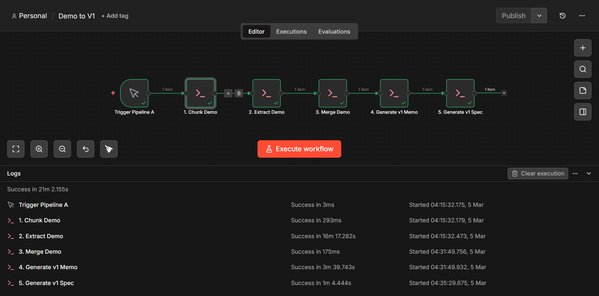
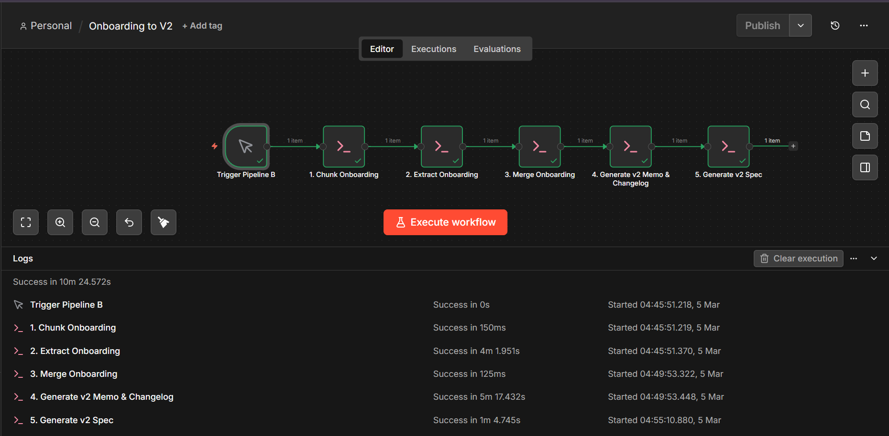

# Clara AI Voice Agent - Automation Orchestration Pipeline

## Project Overview

This project automates the end-to-end generation of operational configurations and system prompts for Retell AI voice agents. It takes raw contractor sales and onboarding calls, extracts crucial business logic (business hours, routing rules, pricing), and formats them into strict, production-ready JSON schemas and Markdown changelogs.

The architecture is built for 100% zero-cost local execution, utilizing n8n for visual orchestration, modular Node.js scripts for batch processing, and a locally hosted Llama 3.2 model for natural language extraction.

## Tech Stack

- **Orchestration**: n8n (Self-hosted via Docker)
- **LLM Engine**: Ollama running `llama3.2` locally
- **Transcription Pipeline**: FFmpeg & OpenAI Whisper
- **Scripting & Processing**: Node.js, Axios
- **Architecture Pattern**: Map-Reduce (Chunk -> Extract -> Merge -> Generate)

## Data Preparation: From Video to Text

Before the LLM pipeline begins, the raw call data must be prepared. The initial data source consisted of recorded video calls.

1. **Audio Extraction**: Used FFmpeg to strip the video feed and extract high-quality audio tracks.
2. **Transcription**: Pushed the extracted audio through OpenAI's Whisper model to generate highly accurate, diarized text transcripts (saved as `.txt` files in the `/dataset` folder).

## How It Works (The Pipelines)

To handle LLM context limits and ensure accurate data extraction, the system utilizes a Map-Reduce pattern split across two distinct pipelines.

### Pipeline A: Demo Call (V1 Setup)



Processes initial sales/demo calls to establish the baseline configuration.

1. **Chunking**: Splits the long transcript into manageable 6,000-character blocks.
2. **Extraction**: Llama 3.2 extracts raw facts (Company info, services, tools).
3. **Merging**: Combines the extracted facts into a single summary.
4. **Generation**: Fills out the `v1/memo.json` and generates the finalized `v1/agent_spec.json` Retell prompt.

### Pipeline B: Onboarding Call (V2 Update)



Processes the follow-up onboarding call to update the configuration with hard operational rules.

1. **Chunk/Extract/Merge**: Repeats the extraction process focusing specifically on operational rules (business hours, routing, emergency definitions).
2. **Update**: Merges new data into the existing V1 JSON to create `v2/memo.json`.
3. **Changelog**: Generates a `changes.md` file explaining what changed from V1 to V2 and why.
4. **Final Spec**: Generates the updated `v2/agent_spec.json`.

## Step-by-Step Setup & Execution

### Prerequisites

1. Install Docker Desktop.
2. Install Node.js.
3. Install Ollama and pull the model by running: `ollama run llama3.2`

### 1. Clone the Repository & Install Dependencies

First, clone this repository to your local machine and navigate into the project directory:

```bash
git clone https://github.com/Kumayl-Lokhandwala/clara-ai-voice-agent-automation
cd clara-agent-automation

```

Then, install the required Node packages:

```bash
npm install

```

### 2. Start n8n Orchestrator

To run n8n locally with the correct permissions and network bridges to access your local Ollama instance, run the included Docker Compose file:

```bash
docker-compose up -d

```

n8n will now be available at `http://localhost:5678`.

### 3. Import Workflows

- Open n8n in your browser.
- Create a new workflow.
- Import the workflows from the `/workflows` directory:
- `pipeline_a_demo_to_v1.json`
- `pipeline_b_onboarding_to_v2.json`

### 4. Execute the Batch Process

Click **"Execute Workflow"** on the n8n canvas.
The workflows utilize master batch scripts (`runBatchA.js` and `runBatchB.js`) via the Execute Command node. This will automatically loop through all 5 demo and onboarding calls (`account_001` through `account_005`), cascading the outputs into the `/outputs` folder.

## Challenges Faced & Solutions

Building a fully automated, zero-cost local pipeline presented several engineering hurdles:

- **Local LLM JSON Formatting (Empty Objects):**
- **Challenge:** Smaller models like Llama 3.2 often panicked when forced into strict JSON format with complex update instructions, returning an empty `{}` object instead of the actual data.
- **Solution:** Pivoted from complex "merge these two datasets" prompts to a strict "Fill-in-the-blanks" template structure. By explicitly providing the full JSON schema in the prompt and treating the LLM like a data-entry clerk, the model reliably output 100% accurate JSON structures.

- **Context Window Limitations:**
- **Challenge:** Feeding a full 30-minute transcript into a local 3B parameter model resulted in severe hallucinations and dropped information.
- **Solution:** Engineered a robust Map-Reduce script pipeline. Transcripts are chunked, facts are extracted per chunk, and then re-merged before final JSON generation. This guarantees no operational rules are missed.

- **Docker Networking & n8n Node Permissions:**
- **Challenge:** Running n8n in a Docker container meant it could not natively reach the host machine's Ollama instance (`localhost` pointed to the container itself), nor could it execute local `.js` files due to n8n's strict security policies on the Execute Command node.
- **Solution:** Configured the `docker-compose.yml` to map the local directory to `/data`, added the `--add-host host.docker.internal:host-gateway` flag to bridge the network to Ollama, and explicitly bypassed the node security block using `-e NODES_EXCLUDE="[]"`.

## Repository Structure

```text
clara-agent-automation/
├── assets/                  # Architecture diagrams
├── changelog/               # Global changelogs showing v1 to v2 updates
├── dataset/
│   ├── demo_calls/          # Raw demo call transcripts (.txt)
│   └── onboarding_calls/    # Raw onboarding transcripts (.txt)
├── outputs/
│   └── accounts/            # Generated artifacts organized by account_id
│       ├── account_001/
│       │   ├── v1/          # Initial memo.json and agent_spec.json
│       │   └── v2/          # Updated memo.json, agent_spec.json, and changes.md
├── scripts/                 # Node.js processing scripts and batch runners
├── workflows/               # Exported n8n workflow JSON files
├── docker-compose.yml       # Docker configuration for n8n orchestration
└── README.md

```

## Submission Video

https://youtu.be/1mCXnWfd6Pw
